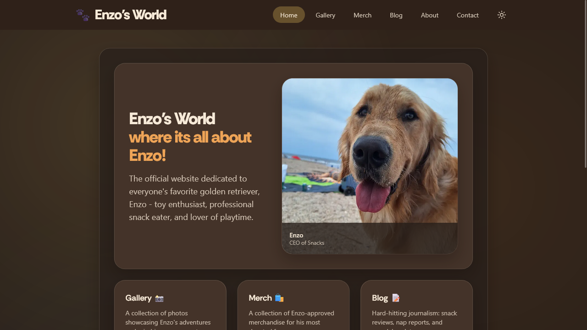
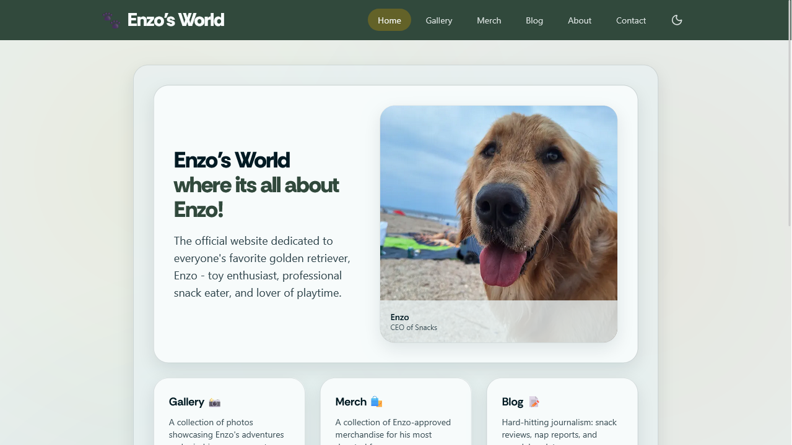
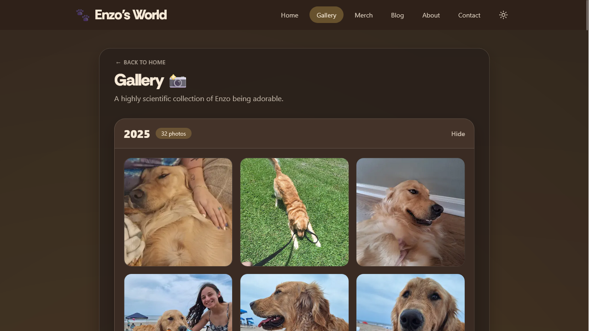
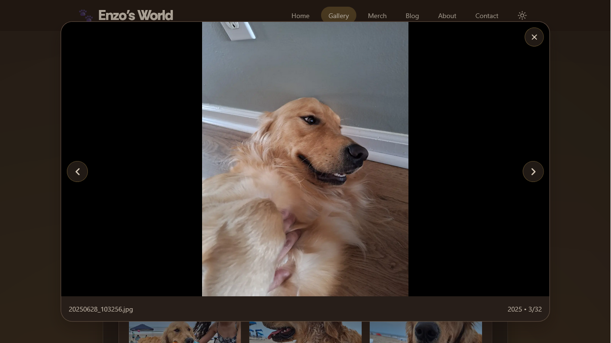
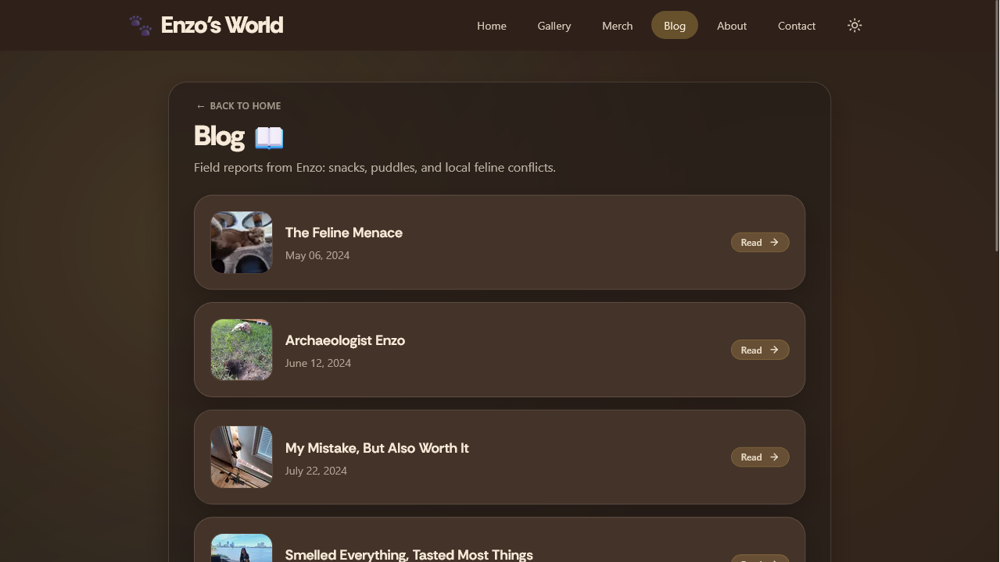
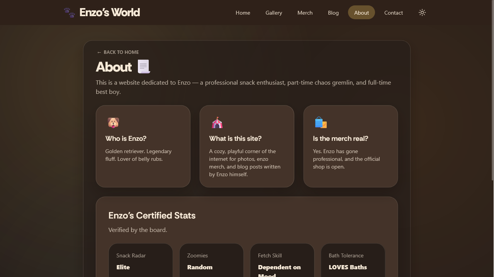
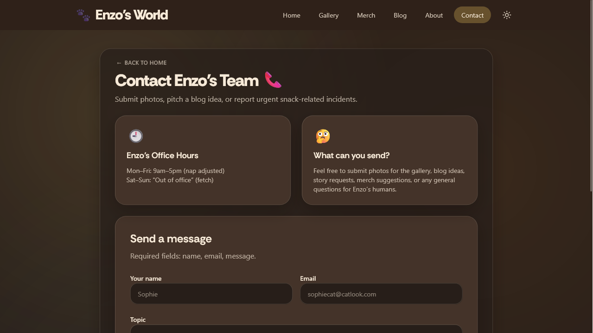
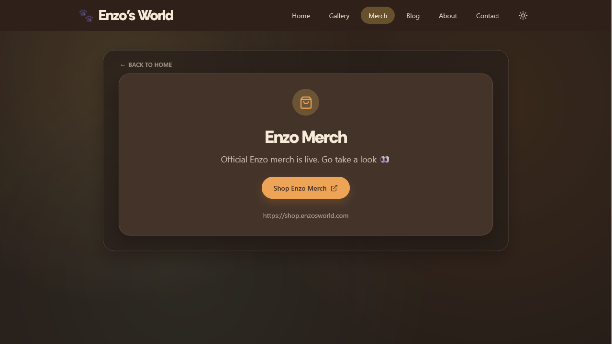
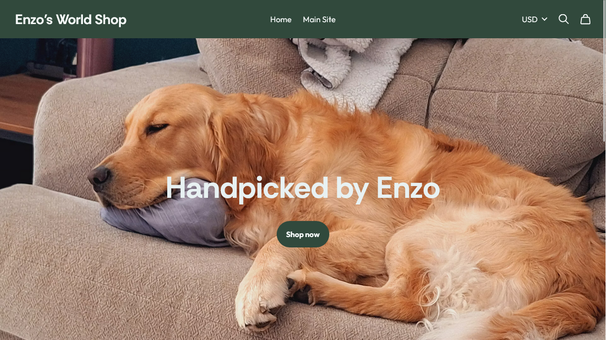
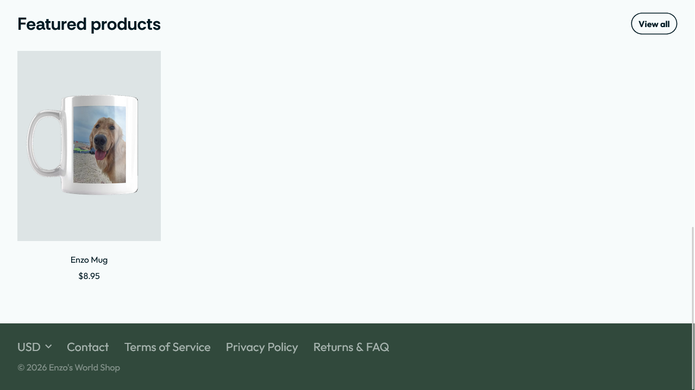

# Enzo's World

Enzo's World is a clean, playful web application dedicated to Enzo: professional snack enthusiast, full-time good boy, and occasional author of suspiciously detailed field reports.

The site combines a curated photo gallery, MDX-powered blog posts, newsletter signups, a contact form, and a merch bridge to Enzo's official Fourthwall shop. The tone is lighthearted, but the implementation focuses on responsive UI, reusable components, accessible interactions, and practical form handling.

## Overview

Enzo's World is designed to feel like a small, complete home base for everything Enzo: photos, stories, contact, and merch all share the same warm visual style while staying easy to browse on any device.

## Screenshots

| Home: dark mode | Home: light mode |
| --- | --- |
|  |  |

| Gallery grid | Gallery lightbox |
| --- | --- |
|  |  |

| Blog | About |
| --- | --- |
|  |  |

| Contact | Merch Shop Link |
| --- | --- |
|  |  |

| Shop landing | Featured products |
| --- | --- |
|  |  |

## Features

1. Gallery: A curated collection of Enzo photos organized in a responsive grid, with a lightbox for browsing full-size images.

2. Blog: Lighthearted MDX posts written from Enzo's perspective, rendered through modern Next.js routing and reusable page layouts.

3. Newsletter: A Turnstile-protected blog signup form that adds subscribers to a Resend segment for monthly updates.

4. Merch: A dedicated merch page that sends visitors to Enzo's official Fourthwall storefront at `shop.enzosworld.com`.

5. Contact Form: A production contact flow with client-side validation, Cloudflare Turnstile verification, and email delivery through Resend.

6. Responsive Design: The entire site is optimized for both desktop and mobile devices, with layouts that adapt cleanly across screen sizes.

7. Custom Theme: A warm, friendly visual system with light and dark modes, reusable card components, consistent spacing, and polished typography.

## Tech Stack

- Framework: Next.js 16
- Library: React 19
- Language: TypeScript
- Styling: Tailwind CSS v4
- Content: MDX
- Form protection: Cloudflare Turnstile and a honeypot field
- Email and newsletter contacts: Resend

## Local Development

Install dependencies and start the development server:

```bash
npm install
npm run dev
```

Create the required environment variables for the contact form before testing submissions:

- `NEXT_PUBLIC_TURNSTILE_SITE_KEY`
- `TURNSTILE_SECRET_KEY`
- `RESEND_API_KEY`
- `RESEND_NEWSLETTER_SEGMENT_ID`
- `CONTACT_TO_EMAIL`
- `CONTACT_FROM_EMAIL`

## Newsletter

The blog page includes a monthly newsletter signup form. Create a Resend segment for the newsletter, then set `RESEND_NEWSLETTER_SEGMENT_ID` to that segment ID in local and production environments.

Monthly newsletters can be sent from the Resend dashboard as a Broadcast to the newsletter segment. Broadcasts should include the normal unsubscribe link and sender details required for mailing-list compliance.

## Deployment

The main site is deployed on Vercel. DNS is managed through Cloudflare, and the shop subdomain points visitors to the Fourthwall storefront.
